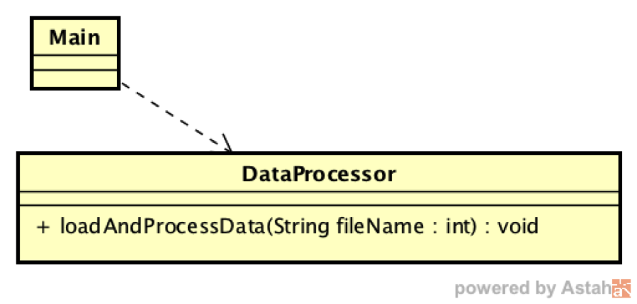
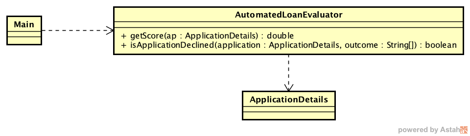

## Escuela Colombiana de ingeniería
### Procesos de Desarrollo de Software
### Principios de Diseño / S.O.L.I.D. / patrones GoF

Trabajo individual o en parejas.
##### Próximo martes: al menos los casos de prueba del punto 2 definidos e implementados.
##### Jueves 2:30pm : ejercicio terminado.

## Punto 1. (carpeta GoF-ChainOfRep-fileProc)

DATAPROC® es una aplicación que hace análisis de datos estadísticos a partir de archivos de diferentes formatos. La aplicación actualmente soporta 4 (formatos) muy comunes, pero la idea es aumentar este número en el corto plazo. Para este requerimiento, esta solución cumple con el principio Abierto/Cerrado?. Revise el patrón Chain of Responsability (https://sourcemaking.com/design_patterns/chain_of_responsibility) y aplíquelo (en un nuevo diseño).



Una vez hecho esto, actualice el diagrama UML suministrado.

#### Criterios de evaluación:
* La clase DataProcessor queda abierta para extensión, cerrada para modificación, en lo que respecta al soporte de nuevos tipos de dato. Es decir, se debe poder agregar el soporte a un nuevo formato sin necesidad de modificar la clase.
* Se implementa correctamente el patrón _Chain of responsability_ para el propósito anterior.
* Se actualiza el diagrama de clases UML, haciendo uso correcto de los elementos del lenguaje (UML), evidenciando la equivalencia con el patrón antes indicado, y con correspondencia a lo implementado.


## Punto 2. (Carpeta GoF-ChainOfRep-LoanApproval)

El siguiente modelo de clases es extraído de una aplicación Web para la evaluación automática de solicitudes de crédito disponible en GitHub. La clase AutomatedLoanEvaluator es el núcleo de dicha aplicación, pues tiene todas las reglas para calcular el puntaje (a partir del cual la compañia evalúa el riesgo y decide si otorga el préstamo o no) mediante el método getScore(). Para reducir el número de aplicaciones que se van a evaluar, se tiene otro método (isApplicationDeclined()) con las reglas que determinan cuales de dichas aplicaciones son inmediatamente descartables (es decir, que ni siquiera se les calculará el puntaje), por temas como edad del solicitante o su salario.




El objetivo es hacer _refactoring_ a la aplicación, de manera que:

1. Quede abierta para extensión, cerrada para modificación, respecto a los puntajes asociados al propósito del crédito, los cuales son usados para el cálculo de puntaje final.

2. Quede abierta para extensión, cerrada para modificación, respecto a las reglas que descartan de entrada una aplicación. Como se observa en el código original, estas reglas no tienen relación entre sí, y basta con que la aplicación cumpla con una de esas reglas para ser descartada (es decir, cuando cumple una, no evalúa las demás).
 
Este sistema, aunque no es muy 'elegante' desde el punto de vista de su diseño, ya ha mostrado realizar correctamente los cálculos y las evaluaciones requeridas por la empresa que lo usa. Por esta razór, este ejercicio de _refactoring_ implica un riego. Por lo anterior, el ejercicio se plantea de la siguiente manera:

1. Antes de modificar el código, defina e implemente un conjunto de pruebas para los métodos isApplicationDeclined() y getScore(). Para las mismas tenga en cuenta:

	* Para la definición de las pruebas de isApplicationDeclined() aplique un [análisis de frontera](https://www.guru99.com/equivalence-partitioning-boundary-value-analysis.html), es decir, considerando límites inferiores, superiores y valores medios.
	* Para la definición de las pruebas de getScore() seleccione sólo algunos casos (tipos de préstamo), y use como valor esperado lo que arroja actualmente el método. Ojo: tengan en cuenta que los números reales NO siempre son comparables.
	* Para ejecutar las pruebas en el entormo de Maven:

		```java
		mvn compile
		mvn test
		```


2. Al tener su conjunto de pruebas (que debería NO generar errores, pues se está tomando la implementación actual como correcta), haga uso del patrón _chain of responsability_ para los dos objetivos antes planteados. Tenga en cuenta que, aunque es el mismo patrón, su aplicación en estos dos casos tiene un funcionamiento ligeramente diferente. Use las pruebas como herramienta para validar la consistencia de su implementación:


3. Defina un nuevo tipo de motivo de rechazo de aplicación (por ejemplo, tener un salario de menos de 20.000 anuales pero estando casado). Defina un caso de prueba adicional para este escenario (es decir en la prueba asociar el criterio antes mencionado a AutomatedLoanEvaluator, haciendo uso del patrón), impleméntelo y verifique su resultado.
4. Actualice el diagrama UML suministrado.


#### Criterios de evaluación:
* La clase AutomatedLoanEvaluator queda abierta para extensión, cerrada para modificación, en lo que respecta a la incorporación de puntajes asociados a tipos de préstamo y a las reglas que descartan automáticamente las aplicaciones. 
* Se implementa correctamente el patrón _Chain of responsability_ para el propósito anterior.
* Se actualiza el diagrama de clases UML, haciendo uso correcto de los elementos del lenguaje (UML), evidenciando la equivalencia con el patrón antes indicado, y con correspondencia a lo implementado.
